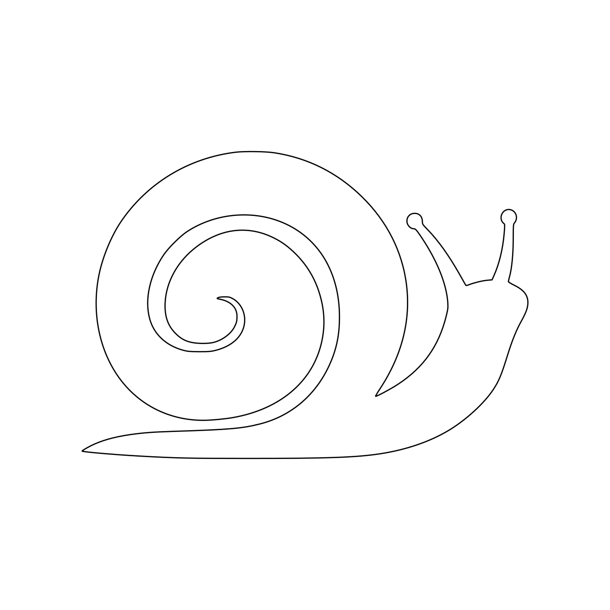
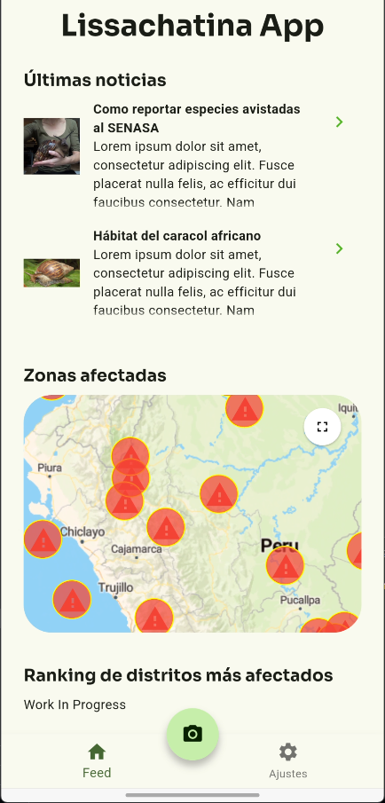
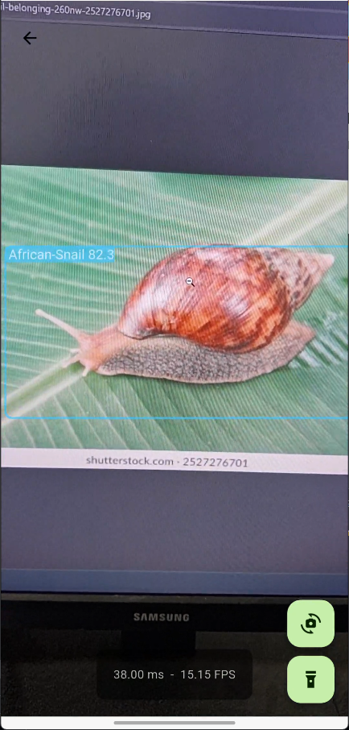
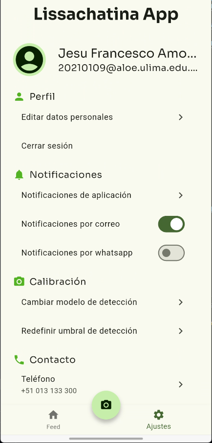

# Lissachatina App: Detector del gigante caracol africano

    

    
    
    
    
    
    
    

---

## Descripción

Repositorio de app móvil con Flutter.

## Imágenes de aplicación en curso

    

    

    

